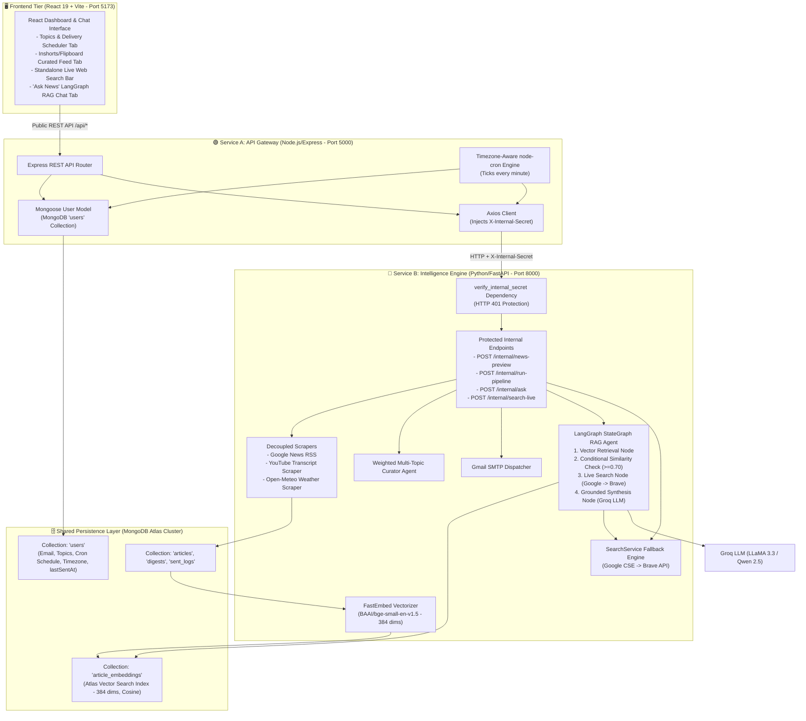

# AI News Aggregator & Intelligence Feed — Master Project & Interview Handbook

This living guide contains everything you need to deeply understand the architecture, design choices, data pipelines, vector search, and agentic workflows of the project, allowing you to speak about it with authority and clarity in senior engineering and full-stack/AI interviews.

---

## 1. 30-Second Elevator Pitch (For Interviewers)

> *"I built a production-grade, multi-tier **AI News Intelligence & Real-Time Q&A Platform** that automatically aggregates, curates, and delivers customized news across multiple domains (Frontier AI, Geopolitics, Local, Sports, Weather) at **zero cloud infrastructure cost**.*
>
> *The architecture follows a decoupled **two-service split**: a **Node/Express API Gateway** managing user preferences, timezone-aware `node-cron` schedules, and public REST routes; and a **Python FastAPI Intelligence Engine** handling keyless scraping, anti-hype LLM summarization (Groq), **MongoDB Atlas Vector Search** with local FastEmbed vectors, and a **LangGraph StateGraph Agent** with automated live web search fallback (Google Custom Search + Brave Search).*
>
> *Users interact with a responsive **Inshorts/Flipboard-style React dashboard** featuring customizable channels, instant on-demand briefing previews, live web search, and a conversational RAG Q&A assistant."*

---

## 2. Problem Statement & Motivation

### The Problem
* **Information Overload & Fragmented Sources:** Critical updates in AI, world affairs, and regional events are scattered across technical blogs, research papers, YouTube channels, and mainstream news outlets.
* **Clickbait Fluff & Marketing Hype:** Modern news articles and videos are saturated with sensationalist headlines and low-density filler.
* **Prohibitive Infrastructure Costs:** Standard RAG pipelines and scheduled SaaS aggregators often rely on expensive proprietary LLMs (GPT-4o), hosted vector stores (Pinecone), and paid cron servers.
* **Stale Knowledge in Standard RAG:** Vector-only RAG systems fail when asked about breaking events or topics not yet indexed in the local database.

### The Solution
* **Multi-Source Keyless Scraping:** Extracts raw articles, weather forecasts, and video transcripts automatically with zero paid API keys.
* **Anti-Hype LLM Summarization:** Transforms lengthy articles and transcripts into concise, 3-bullet technical takeaways using Groq LPU inference.
* **Two-Service Architecture:** Isolates user authentication, MongoDB state management, and cron scheduling in Node.js, while offloading intensive ML/LLM/Vector operations to FastAPI.
* **LangGraph-Orchestrated Hybrid RAG:** Combines **MongoDB Atlas Vector Search** (384-dimensional dense embeddings) with automatic **Google CSE / Brave Search fallback** via a stateful conditional graph.
* **Zero Infrastructure Cost:** Runs 100% on free tiers (Groq, MongoDB Atlas M0, FastEmbed on CPU, Open-Meteo, Google/Brave free tiers, Gmail SMTP).

---

## 3. High-Level Architecture & System Topology

---

## 4. Tech Stack & "Why This Tool?" (Interview Justifications)

| Technology | Purpose | Why We Chose It (Interview Answer) |
| :--- | :--- | :--- |
| **Node.js & Express** | Service A (Public API Gateway) | Lightweight, non-blocking I/O ideal for API gateways, request validation, and running background cron schedules without blocking CPU-intensive ML tasks. |
| **Python 3.12 + FastAPI** | Service B (Intelligence Engine) | Native ecosystem for AI/ML, asynchronous request handling, high throughput, and seamless integration with LangGraph, FastEmbed, and LLMs. |
| **React 19 & Vite** | Frontend Client | Ultra-fast HMR build tool, declarative UI rendering, responsive card grid design, and clean proxy routing to Service A. |
| **MongoDB Atlas (M0 Free Tier)** | Shared Database & Vector Store | Unified cloud database for user documents, articles, digests, and **native Vector Search** (`$vectorSearch`), avoiding the need for an external vector DB. |
| **`fastembed` (`BAAI/bge-small-en-v1.5`)** | Local Vector Embeddings | Fast, quantized, CPU-optimized embedding generation (384 dimensions) running locally in <5ms with **0 API cost** and no external rate limits. |
| **LangGraph (`StateGraph`)** | Agentic Workflow & Fallback Routing | Models retrieval, evaluation, and search fallback as a deterministic, stateful graph with conditional edges rather than fragile linear chains. |
| **Groq API (`qwen/qwen3.8-27b`, `openai/gpt-oss-120b`)** | LLM Inference Engine | Ultra-fast token generation (~500 tokens/sec), OpenAI API compatibility, and a generous free tier for structured JSON generation. |
| **Google Custom Search JSON API** | Primary Live Web Search | Rich web search results directly from Google index with 100 free queries/day. |
| **Brave Search API** | Fallback Live Web Search | Privacy-focused independent search index with 2,000 free queries/month used as automatic fallback when Google hits quota or rate limits. |
| **`node-cron`** | Scheduled Delivery Engine | Timezone-aware in-process scheduler that dynamically parses IANA timezones (e.g. `Asia/Kolkata`, `America/New_York`) to trigger user digests at their exact local time. |
| **`youtube-transcript-api`** | Video Content Extraction | Extracts subtitles/transcripts directly from YouTube video IDs without needing paid YouTube Data API v3 quotas. |
| **Open-Meteo API** | Weather Forecasting | Completely keyless, open-source weather API providing temperature, precipitation, and conditions based on coordinates. |
| **Gmail SMTP (`smtplib`)** | Email Delivery | Reliable TLS-encrypted email dispatcher using Google 16-character App Passwords and responsive HTML email templates. |

---

## 5. Core Architectural Concepts (Explained in Plain English)

### 1. Two-Service Split & Internal Secret Authentication
* **Concept:** Separating public gateway concerns (user management, routing, rate limiting) from internal intelligence engines (scraping, vector search, LLMs).
* **How We Apply It:** Service A (Express on port 5000) exposes public `/api/*` endpoints to the React frontend. When it needs AI or scraping capabilities, it calls Service B (FastAPI on port 8000) injecting a cryptographically secure `X-Internal-Secret` header. FastAPI enforces this via `verify_internal_secret` dependency and rejects any direct unauthorized request with `HTTP 401 Unauthorized`.

### 2. Dense Vector Embeddings & MongoDB Atlas Vector Search
* **Concept:** Converting unstructured text (article titles + summaries) into mathematical vectors (lists of 384 floating-point numbers) where semantic similarity corresponds to spatial proximity (cosine similarity).
* **How We Apply It:** We use `fastembed` locally to vectorize all digests. Vectors are persisted in `news_aggregator.article_embeddings`. Atlas indexes this collection with an index definition (`type: "vectorSearch"`, `numDimensions: 384`, `similarity: "cosine"`, `filter: ["topic"]`). Retrieval queries use MongoDB's `$vectorSearch` pipeline stage scoped to the user's active topics.

### 3. LangGraph Stateful Agent with Conditional Fallback
* **Concept:** Instead of a rigid linear pipeline, LangGraph structures the agent as a state machine (`StateGraph`) with nodes, state transitions, and conditional routing.
* **How We Apply It:** 
  1. `_vector_search_node`: Queries local vector database for matches.
  2. `_check_retrieval_condition`: Inspects top cosine similarity score. If `top_score >= 0.70`, routes to `_synthesize_answer_node`. If results are empty or similarity < 0.70, routes to `_live_search_node`.
  3. `_live_search_node`: Queries Google Custom Search -> Brave Search.
  4. `_synthesize_answer_node`: Prompts Groq LLM to produce a grounded briefing with source citations and marks `from_live_search: True/False`.

### 4. Resilient Multi-Tier Search Fallback with Quota Tracking
* **Concept:** Combining multiple third-party APIs with different quota structures to maximize uptime and prevent user disruption.
* **How We Apply It:** `SearchService` tracks daily Google queries in-memory. If Google returns HTTP 429, errors out, or hits 90 queries/day, it automatically falls back to Brave Search API. If both fail, it returns an empty list gracefully without throwing an uncaught exception.

---

## 6. Complete Implementation Walkthrough by Phase

### Phase 1–8: Core Scraper, LLM Summarizer & SMTP Foundation
* Built modular scrapers (`GoogleNewsScraper`, `RssScraper`, `YouTubeScraper`, `WeatherScraper`).
* Built `DigestAgent` with multi-model fallback chain (`qwen/qwen3.8-27b`, `openai/gpt-oss-120b`).
* Built `CuratorAgent` with weighted multi-topic scoring and HTML newsletter generation via Gmail SMTP.

### Phase 9: MongoDB Atlas Cloud Migration & Dynamic Topics
* Migrated from local SQLite to MongoDB Atlas.
* Built `MongoRepository` managing indexed collections (`users`, `articles`, `digests`, `sent_logs`, `article_embeddings`).

### Phase 10: Two-Service Architecture Split & Gateway Security
* **Files:** `app/api/auth.py`, `app/api/routes/internal.py`, `backend-express/server.js`, `backend-express/services/fastapiClient.js`.
* Created internal endpoints (`/internal/news-preview`, `/internal/run-pipeline`, `/internal/ask`) protected by `X-Internal-Secret`.
* Built Express proxy gateway forwarding frontend traffic and masking internal errors with HTTP 502 guards.

### Phase 11: Timezone-Aware Scheduler with `node-cron`
* **Files:** `backend-express/services/scheduler.js`, `backend-express/models/User.js`.
* Background cron ticks every 60 seconds, converts current UTC time to each user's local timezone (via `Intl.DateTimeFormat`), and executes the pipeline when local time matches `schedule.time` (e.g., `07:00`).

### Phase 12: React Inshorts / Flipboard Dashboard Overhaul
* **Files:** `frontend/src/App.jsx`, `frontend/src/index.css`, `frontend/vite.config.js`.
* Designed card UI with dedicated tokens (`#6C5CE7` Primary, `#00D9A5` Secondary, `#FF9F43` Warm Accent, `#F7F7FC` Background).
* Added explicit "Get News Now" CTA, skeleton loaders, and local storage state persistence.

### Phase 13: MongoDB Atlas Vector Search & FastEmbed Pipeline
* **Files:** `app/services/embedding_service.py`, `app/scripts/backfill_embeddings.py`, `app/database/repository.py`.
* Integrated local 384-dimensional `fastembed` (`BAAI/bge-small-en-v1.5`).
* Automatically vectorizes newly processed digests and backfilled 118 historical records to Atlas `article_embeddings`.

### Phase 14: LangGraph RAG Q&A Agent & Live Web Search Fallback
* **Files:** `app/services/search_service.py`, `app/agent/rag_agent.py`, `backend-express/routes/search.js`, `backend-express/routes/ask.js`.
* Built `SearchService` supporting Google Custom Search API and Brave Search API with automatic error/quota failover.
* Implemented `RAGAgent` using `langgraph.graph.StateGraph` for vector similarity checking and automated live search fallback.
* Added "Ask News" conversational chat tab and standalone Live Web Search bar on the React dashboard.

---

## 7. Top Technical Interview Questions & Expert Answers

### Q1: "Why split the system into Node/Express and Python/FastAPI instead of a single monolith?"
> **Answer:** *"The two services have distinct operational profiles and lifecycle requirements. Node/Express is exceptionally lightweight for public I/O routing, user preference CRUD operations, and maintaining timezone-aware `node-cron` timers that run indefinitely. 
> 
> Python/FastAPI, on the other hand, is the optimal ecosystem for LLM orchestration, local embedding vectorization (FastEmbed/ONNX), LangGraph state machines, and keyless scraping pipelines. 
> 
> By decoupling them behind a private `X-Internal-Secret` header, we can scale or restart the scraping/ML workers independently without interrupting active user dashboard connections or cron timers."*

### Q2: "How does your RAG system work and how do you prevent hallucinations?"
> **Answer:** *"Our RAG pipeline uses a grounded, two-tiered retrieval architecture orchestrated by LangGraph:
> 1. When a user asks a question, we compute a 384-dimensional dense vector using local FastEmbed and execute a topic-scoped `$vectorSearch` in MongoDB Atlas.
> 2. The LangGraph state machine evaluates the top result's cosine similarity. If the score is below 0.70 or no matches exist, it automatically invokes live web search (Google CSE / Brave Search) for fresh ground truth.
> 3. We pass retrieved articles into Groq LLM with a strict system prompt that instructs the model to answer solely using the provided context blocks and explicitly cite the source publication for every claim. If information is missing, the model is instructed to state what is unknown rather than guessing."*

### Q3: "Why use local FastEmbed embeddings instead of OpenAI or Gemini embedding APIs?"
> **Answer:** *"FastEmbed runs quantized ONNX models (`BAAI/bge-small-en-v1.5`) directly on the CPU. It generates 384-dimensional vectors in under 5 milliseconds with zero network latency, zero API costs, and zero rate limits. For news headlines and summaries, `bge-small-en` achieves top-tier ranking performance on MTEB benchmarks while eliminating external API dependencies."*

### Q4: "How does LangGraph improve your agent architecture compared to simple sequential chains?"
> **Answer:** *"Traditional linear chains assume that every step always succeeds and executes in a fixed order. In real-world news Q&A, stored vector embeddings might be insufficient or outdated. 
> 
> With LangGraph, we define an explicit `StateGraph` where state transitions are governed by conditional edges. If vector search similarity is sufficient, the graph takes the fast path directly to synthesis. If similarity is low, the graph conditionally branches to the live search node before converging at synthesis. This makes the execution flow inspectable, testable, and resilient."*

### Q5: "How do you handle multi-provider search fallback and quota limits?"
> **Answer:** *"Google Custom Search provides 100 free queries/day, while Brave Search provides 2,000 free queries/month. Our `SearchService` maintains an in-memory daily query counter for Google. If Google returns HTTP 429, errors out, or nears its 90-query threshold, the service automatically routes the query to Brave Search. The caller receives normalized results regardless of which provider fulfilled the query."*

### Q6: "How do you ensure duplicate news is never scraped or emailed to users?"
> **Answer:** *"We enforce idempotency at two stages:
> 1. **Scraping Layer**: The repository checks if the article `url` already exists in MongoDB before inserting. Duplicate URLs are ignored.
> 2. **Delivery Layer**: We maintain a `sent_logs` collection recording `user_id` and `digest_id`. Before generating the email, the curation service filters out all previously sent digest IDs, committing newly delivered IDs in the database transaction."*

---

*(Master Handbook updated with complete Two-Service Split, MongoDB Atlas Vector Search, FastEmbed, LangGraph StateGraph, and Live Search Fallback).*
