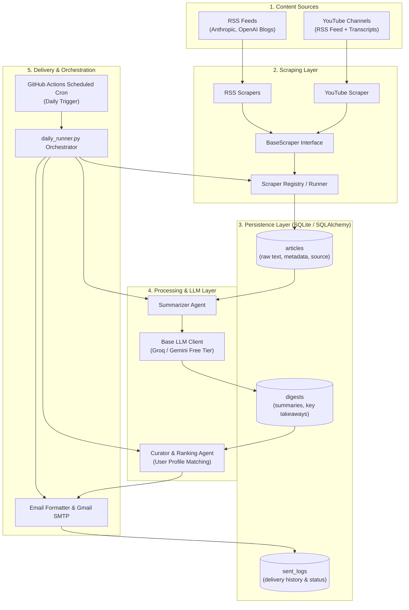

# AI News Aggregator — Supervisor Build Blueprint

This document defines the architectural blueprint, technology selection (100% free-tier replacements), phase breakdown, and milestone verification criteria for building an intelligent AI News Aggregator from scratch.

As your supervisor, I will guide you through each phase step-by-step, review your code, spot edge-cases, and validate each milestone before you advance.

---

## 1. System Architecture



---

## 2. Free-Tier Technology Matrix

| Original Component | Free Replacement | Tier Limits & Practical Advice |
| :--- | :--- | :--- |
| **LLM (Summarization & Ranking)** | **Groq API** (`llama-3.3-70b-versatile` / `llama-3.1-8b-instant`) or **Google Gemini API** (`gemini-2.5-flash`) | **Groq**: Free, ultra-fast (~500 t/s), standard OpenAI-compatible SDK.<br/>**Gemini**: Free tier 15 RPM / 1M TPM. |
| **Database** | **SQLite** (via SQLAlchemy) | Single-file (`data/news.db`), 0 infrastructure cost, instant setup, perfectly suited for single-user daily digest. |
| **Cron / Worker** | **GitHub Actions** (`on: schedule` cron) | 2,000 free minutes/month for private repos (unlimited for public). Runs script daily in ~45 seconds. |
| **Proxies** | **Direct Scraping + YouTube RSS** | YouTube video listing via channel RSS requires no API key. `youtube-transcript-api` runs unblocked for low volume (5-15 videos/day). |
| **Email Delivery** | **Gmail SMTP** (`smtp.gmail.com:465` / `587`) | Standard free Gmail account with a 16-character **App Password**. |

---

## 3. Project Directory Blueprint

Here is the clean, decoupled folder structure you will assemble:

```text
ai-news-aggregator/
├── .github/
│   └── workflows/
│       └── daily_digest.yml      # Automated daily trigger
├── app/
│   ├── __init__.py
│   ├── config.py                 # Pydantic Settings / Environment loader
│   ├── database/
│   │   ├── __init__.py
│   │   ├── connection.py         # SQLAlchemy engine & session maker
│   │   ├── models.py             # ORM models (Article, Digest, SentLog)
│   │   └── repository.py         # CRUD repository operations
│   ├── scrapers/
│   │   ├── __init__.py
│   │   ├── base.py               # BaseScraper abstract class & Article dataclass
│   │   ├── rss_scraper.py        # Generic RSS scraper
│   │   └── youtube_scraper.py    # YouTube RSS + Transcript scraper
│   ├── agent/
│   │   ├── __init__.py
│   │   ├── base_llm.py           # LLM client wrapper (Groq/Gemini)
│   │   ├── digest_agent.py       # Prompt & logic for 3-bullet summarization
│   │   └── curator_agent.py      # Profile matching & relevance scoring
│   ├── services/
│   │   ├── __init__.py
│   │   ├── email_service.py      # HTML builder & SMTP dispatcher
│   │   └── pipeline_service.py   # Step-by-step orchestrator
│   └── profiles/
│       └── user_profile.py       # User interests, target topics, exclusion rules
├── data/                         # Ignored directory for SQLite database
├── tests/                        # Unit and integration tests
├── .env.example                  # Template of required secrets
├── .gitignore                    # Secrets, DB files, and cache exclusions
├── pyproject.toml / requirements.txt
└── main.py                       # CLI entry point
```

---

## 4. Phase-by-Phase Execution Plan

### **Phase 0 — Project Skeleton & Environment**
- **Objective**: Establish development environment, dependency management (`uv` or `venv`), configuration loading, and project structure.
- **Your Task**:
  1. Create virtual environment & install baseline dependencies (`pydantic-settings`, `python-dotenv`, `sqlalchemy`, `pytest`).
  2. Create `.gitignore` ignoring `.env`, `data/`, `*.db`, `__pycache__/`.
  3. Create `app/config.py` with environment variables validator.
  4. Create `main.py` entry point.
- **Definition of Done (DoD)**:
  - Running `python main.py` executes cleanly and prints confirmation of loaded configuration.

---

### **Phase 1 — Persistence Layer (Database & Models)**
- **Objective**: Build the SQLite database schema using SQLAlchemy ORM.
- **Your Task**:
  1. Define `Article` model (`id`, `title`, `url`, `source`, `raw_content`, `published_at`, `scraped_at`).
  2. Define `Digest` model (`id`, `article_id`, `summary`, `key_takeaways`, `category`, `created_at`).
  3. Define `SentLog` model (`id`, `digest_id`, `recipient`, `sent_at`).
  4. Write `connection.py` and `repository.py` helper to create tables and run basic CRUD.
- **Definition of Done (DoD)**:
  - A test script successfully creates tables, inserts a mock article & digest, and queries it back.

---

### **Phase 2 — First RSS Scraper (Anthropic / OpenAI Blog)**
- **Objective**: Create `BaseScraper` contract and implement the first live scraper using `feedparser`.
- **Your Task**:
  1. Define `ArticleSchema` dataclass / Pydantic model.
  2. Implement abstract `BaseScraper` class with method `get_articles(hours: int = 24)`.
  3. Implement concrete `RssScraper` supporting multiple feed URLs.
  4. Connect scraper output to `repository.save_articles()`.
- **Definition of Done (DoD)**:
  - Running scraper fetches real recent articles from OpenAI/Anthropic blogs and inserts deduplicated rows into SQLite.

---

### **Phase 3 — YouTube Scraper & Transcript Extractor**
- **Objective**: Scrape video metadata via YouTube channel RSS and extract captions via `youtube-transcript-api`.
- **Your Task**:
  1. Construct YouTube RSS URL handler (`https://www.youtube.com/feeds/videos.xml?channel_id=...`).
  2. Extract video title, URL, published timestamp.
  3. Fetch English transcripts using `youtube_transcript_api.YouTubeTranscriptApi`.
  4. Add fallback logic for videos without transcripts (use video description).
- **Definition of Done (DoD)**:
  - Video metadata and full transcript text for configured channels land cleanly in `articles` table.

---

### **Phase 4 — LLM Summarization Service**
- **Objective**: Wrap Groq / Gemini API to generate structured, actionable 3-sentence summaries + 3 bullet takeaways.
- **Your Task**:
  1. Set up LLM client in `app/agent/base_llm.py` (e.g. `groq` or `google-genai`).
  2. Write system prompt enforcing concise, hype-free technical summaries.
  3. Implement `process_unprocessed_articles()` to fetch raw articles, call LLM, and persist results to `digests` table.
- **Definition of Done (DoD)**:
  - Inspecting `digests` table shows clear, well-formatted summaries for all scraped items.

---

### **Phase 5 — Curation & Relevance Ranking**
- **Objective**: Match daily digests against user preferences and rank top 5-10 articles.
- **Your Task**:
  1. Define user profile in `app/profiles/user_profile.py` (topics of interest, ignored topics).
  2. Implement `CuratorAgent` that scores each digest on a 1-10 scale with rationale.
  3. Filter and sort top $N$ digests for the day.
- **Definition of Done (DoD)**:
  - Console prints a ranked leaderboard of today's news with relevance scores and reasoning.

---

### **Phase 6 — Email Digest Generator & Delivery**
- **Objective**: Format the ranked digest into a clean HTML email and dispatch via Gmail SMTP.
- **Your Task**:
  1. Build an aesthetic HTML email template (dark/clean card layout with summary bullets and original links).
  2. Write `email_service.py` using Python `smtplib` + `email.mime` (SSL/TLS).
  3. Log successfully sent digests into `sent_logs` to ensure no article is ever emailed twice.
- **Definition of Done (DoD)**:
  - A real, formatted email lands in your inbox containing today's top curated stories.

---

### **Phase 7 — Pipeline Orchestration & CLI**
- **Objective**: Create a unified runner with logging and error resilience.
- **Your Task**:
  1. Wire the complete flow in `app/services/pipeline_service.py`: `Scrape -> Store -> Summarize -> Rank -> Email -> Log`.
  2. Add structured logging and try/except boundaries so a single failing feed doesn't crash the entire run.
  3. Add CLI flags (e.g., `--dry-run`, `--force-scrape`, `--test-email`).
- **Definition of Done (DoD)**:
  - Running `python main.py` executes the entire pipeline end-to-end reliably.

---

### **Phase 8 — GitHub Actions Automation**
- **Objective**: Deploy the scheduled daily run on GitHub Actions for free hands-off execution.
- **Your Task**:
  1. Create `.github/workflows/daily_digest.yml`.
  2. Configure schedule (`cron: '0 12 * * *'`) and manual trigger (`workflow_dispatch`).
  3. Add secrets (`GROQ_API_KEY`, `EMAIL_USER`, `EMAIL_APP_PASSWORD`, `RECIPIENT_EMAIL`) to GitHub repository settings.
- **Definition of Done (DoD)**:
  - Triggering the GitHub Action manually or on schedule completes successfully and delivers the email.

---

## 5. Supervisor Rules & How We Pair

1. **You write the code**: I provide the architectural boundaries, function signatures, logic guidance, and debugging assistance.
2. **One phase at a time**: We complete and test each phase before moving to the next.
3. **No magic black boxes**: You will understand why every library and design pattern is chosen.

---

## 6. Ready to Begin?

Let's start with **Phase 0: Project Skeleton & Environment**.
Review the blueprint above and let me know when you're ready to initialize the project layout!
